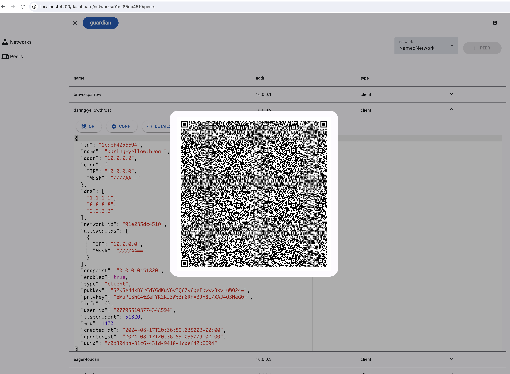

# guardian manages WireGuard networks and peers

Probably the tiniest wireguard manager

> May not be good for serious stuff, but great if you wanna dig in while automating tedious tasks.

## Features (on the roadmap)
- [x] network and peer config crud into PostgreSQL using [pgo](https://github.com/edgeflare/pgo)
- [ ] minimal web UI (in Angular) WIP
- [ ] (remote) config reload (upon new peer addition/deletion)

|                                            |                                              |
|--------------------------------------------|----------------------------------------------|
|  |    |

In addition to recording network and peer configs in Postgres, guardian manages
- [WireGuard](https://www.wireguard.com/)
  - [x] installation/configuration (using [wireguard-tools](https://git.zx2c4.com/wireguard-tools/))
  - [ ] reload interface config (upon new network/peer addition/deletion)
- [CoreDNS](https://github.com/coredns/coredns) for DNS resolution
  - [x] installation/configuration
- [Envoy proxy](https://github.com/envoyproxy/envoy) for service discovery and routing
  - [x] installation/configuration
  - [ ] service discovery and simpler routing
- [EMQX MQTT Broker](https://github.com/emqx/emqx) for exchanging peer status
  - [ ] installation/configuration
  - [ ] peer status exchange

The above components run as containers and can be installed using [wireguard-guardian](https://github.com/edgeflare/helm-charts/tree/main/charts/wireguard-guardian) Helm chart. See [docs](./docs) for config examples, and respective software documentation. Though possible on [Docker](https://www.docker.com), prefer running the containers on a [Kubernetes](https://kubernetes.io) cluster. CNCF approved [k3s](https://github.com/k3s-io/k3s), which runs even on Raspberry Pi, is simple and sufficient for personal and light workloads. Docs have a script, [install-k3s.sh](./docs/install-k3s.sh), for installing k3s with required config. In dev env, maybe try [kind](https://kind.sigs.k8s.io/), [k3d](https://k3d.io/).

## WireGuard
> WireGuard® is an extremely simple yet fast and modern VPN that utilizes state-of-the-art cryptography.

It's great! Learn more at [www.wireguard.com](https://www.wireguard.com/), and across the web.

### Networks

WireGuard networks are composed of peers that communicate securely over encrypted tunnels. These networks can be flexibly configured to suit various topologies and use cases, from simple point-to-point connections to complex multi-site setups.

#### Peer roles/types in guardian

- **Gateway**: The gateway peer acts as the entry and exit point for VPN traffic, typically possessing a public IP address. It facilitates internet access for other peers within the network. Examples: Cloud server, VPS
- **Node**:  A node is a device, usually Linux server, within the private network, often hosting services or sharing resources. Nodes may or may not have a public IP address. Examples: NAS, home media server, nextcloud
- **Client**: Clients are devices that connect to the WireGuard network to access the internet securely and privately, or to interact with other peers. Examples: phones, laptops, MCUs

#### WireGuard mesh network example

## Development/Contributing

The aim of this repo is to simplify WireGuard network management and provide a user-friendly interface for monitoring. You're already contributing by using it! If you want more, please! Open an issue, or a PR.

## License
Apache 2.0
